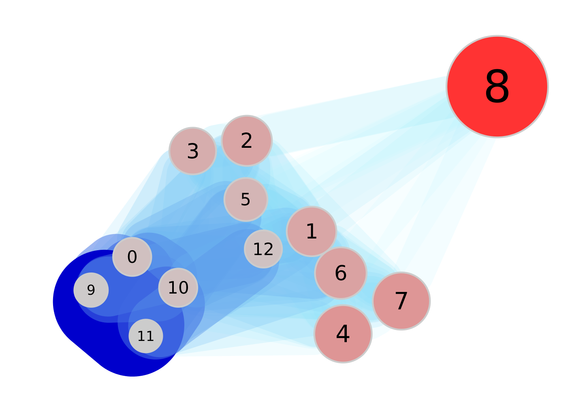
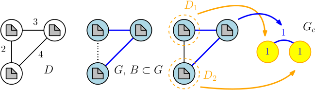

# DocClustering Documentation

Software package to solve PS-Document Clustering.


This package can be either used directly in Python interpreter (or a Jupyter Notebook) or as a standalone application. Please see the first section for documentation on the standalone version. 

<b>Content</b>
1. [ Interactive usage](#interactive-usage)
2. [ Using the standalone Application](#using-the-standalone-application)
3. [ Further information ](#further-information)

<div align="center">

</div>

# Interactive usage
## First steps

This section describes the first steps. For detail information see below. We need to import the class dclustering and create a new object.

```python
from DocClustering.dclustering import *
cluster = dclustering()
```
If no parameters are passed, the dclustering object takes standard parameters. Otherwise you can define the bounds epsilon and iota: <code>cluster = dclustering(0.1,0.4)</code>. Afterwards you can load files or create documents. As default is uses the SCAIview reader:

```python
cluster.readFromFile ("/tmp/Alzheimers_Dement_pmids.json")
```
Now you can do the clustering process while running a heuristic. We refer to dclustering for all heuristics. The default is runSLF:

```python
cluster.runSLF()
```
---
**NOTE**

 There is no problem, if you forget these runs. All functions will check, if the heuristic has run and otherwise run it.

---

There are several ways to inspect the clustering. You may want to export it for Cytoscape usage:

```python
cluster.saveInstanceGraph("/tmp/graph.gml")
```
And you may also use one of the following functions:

```python
cluster.getClusters()
cluster.getClusterDegrees()
cluster.getCluster(8)
cluster.getDocumentList()
```
Different edge counts. Usually only counted, but also relative possible:

```python
cluster.saveInstanceGraph("/home/huba/list1.gml", dclustering.value_edges)
```
It may be useful to convert a PMID List (CSV) to a SCAIView export:

```python
from DocClustering.reader import *
cluster = dclustering()
reader.write_SCAIView_from_PmidList(cluster, "/home/short2.csv", "/home/converted.json", sim=similarity.sim_header)
```
You may also add new values to the value graph, for example with the new class additionalList:

```python
from DocClustering.additionalList import *
cluster.buildValueGraph(valuefun=dclustering.value_edges)
list1 = additionalLists("list2.csv", "Cool label")
cluster.addValueToValueGraph(fun=list1.getListValue,valuefun=dclustering.value_edges)
```

## Different ways of loading Data

You can specify a Reader method when using <code>readFromFile</code>:
```python
cluster.readFromFile ("/tmp/data.json", method=reader.read_SCAIview_Nodes)
```
The following readers are available:

| reader     | format                                                  | 
| -------- | ---------------------------------------------------------- |
| read_SCAIview  | Reads JSON Export from SCAIView
| read_SCAIview_Nodes | Reads JSON Export from SCAIView but calculates a new similarity measure |
| read_PmidList | Reads a plain list of PMIDs, receives data from Pubmed|

Beside this, it is also possible to open and save the instances directly:
```python
cluster.open(filename1)
cluster.save(output)
```
## Different similarity measures

You can specify a similarity meausre when using <code>readFromFile</code>:
```python
cluster.readFromFile ("/tmp/data.json", method=reader.read_SCAIview_Nodes, sim=similarity.sim_textPca )
```
The following similarity measures are available:

| measure     | explanation                                                  | 
| -------- | ---------------------------------------------------------- |
| sim_Mesh  | Jacard Distance for MeSH terms
| sim_journal | 0 if different journal, 1 if same journal
| sim_textPca | TF.IDF similarity measure on available text
| sim_given | Used to keep the similarity from import |

## Clustering Methods

We have used the following heuristics to start the graph coloring: 
1. using the <i>greedy independent sets</i> (GIS) approach 
2. using the SLF-Approach
3.  and using the Clique Partition on the complementary graph using the TSENG clique-partitioning algorithm 
All of them are available with the methods <code>runSLF, runGIS</code> and <code>runClique</code>.

## Feature Selection, Output analyses

The network graph is directly available as <code>cluster.G</code> and you may use all networkx functions to analyse it. But we provide some comfortable functions do access the clustering:

| function     | explanation                                                  | 
| -------- | ---------------------------------------------------------- |
| <code>getClusters()</code> 	 | Prints the list of all clusters, example: <br> <code>{0: {'value': 3}}</code>
| <code>getCluster(id)</code> | Returns the information for a given cluster. Example see below.
| <code>getDocumentList()</code> | Returns the same information as <code>getCluster()</code> for all clusters.


Shortened example for <code>getCluster(id)</code>: 
```python
{'ids': '8668184\n|8244990\n|2465183\n|1108020\n|1358501\n|2664292\n|6114691\n|7748926\n|9512348\n|10783745\n',
 'topics': 'Animals (5) Escherichia coli/immunology (4)... ',
 'value': 10,
 'y1976': 1,
...
 'y1999': 1}
```


## Export

Beside of saving the whole instance, DocClustering also offers the possibility to save the whole instance graph as <code>gml</code>-file to process it using other applications. We usually recommend Cytoscape:
```python
cluster.saveInstanceGraph("/tmp/graph.gml")
```


# Using the standalone Application

<code>clustering.py</code> can be used as command line tool. Outputs gml, csv and json files for all heuristics to destination folder. The log is printed on the screen.

The default behaviour is stored in <code>etc/config.cfg</code>. Please change it according to your needs.

Usage: <code>clustering.py [options]</code>

Options:

| task     | parameter                                                  | description                 |
|:--------:|:---------------------------------------------------------- |:----------------------------|
| help  | <code> -h, --help </code> | show this help message and exit |
| input  | <code> -f filename, --file=filename </code> |  The input file in JSON Format |
| directory  | <code>  -d directory, --directory=directory </code> |  Use a different standard directory |
| heuristic  | <code> -a HEURISTIC, --algorithm=HEURISTIC </code> | Define the heuristic to use  SLF, GIS, CLIQUE |
| random  | <code> -r, --random  </code> | Use a random instance |
|    | <code> -o, --only_build  </code> | Only build the graph and do not run graph partition |
| nodes  | <code> -n NODES, --nodes=NODES </code> | Node count for random instances, default 100 |
|  | <code> -e EDGESPERCENT, --edgesPercent=EDGESPERCENT </code> | Percent value until documents are not similar, 0<e<b<100 |
|   | <code> -b EDGESBLUEPERCENT, --blueEdgesPercent=EDGESBLUEPERCENT</code> | Percent value until documents are blue  0<e<b<100 |
# Cite

If you use this software, please cite the following publication:
* Dörpinghaus, J., Schaaf, S., Fluck, J., and Zimmermann, M. (2017). Document
clustering using a graph covering with pseudostable sets. In <i>Proceedings of the
2017 Federated Conference on Computer Science and Information Systems</i>, Annals
of Computer Science and Information Systems, pages 329–338. 

# Further information

Apache License, Version 2.0

Please see 
* Dörpinghaus, J., Schaaf, S., Fluck, J., and Zimmermann, M. (2017). Document
clustering using a graph covering with pseudostable sets. In <i>Proceedings of the
2017 Federated Conference on Computer Science and Information Systems</i>, Annals
of Computer Science and Information Systems, pages 329–338. 

